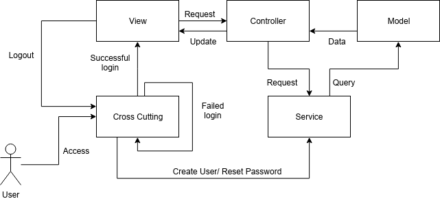

# IonicAppCVProfileMaker

`UNFINISHED PRODUCT`

A mobile application in which users can create their mock CV profiles online, view others' and rate them.

# Application Setup

To connect this app with a Firebase database, in src/app/ create a `credentials.ts` file with all the Firebase API configurations.

# Codebase

`Ionic Angular`

`Javascript/Typescript`

# Model-View-Controller

